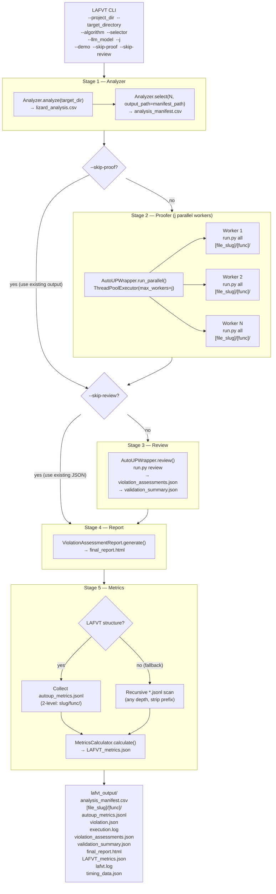

# LAFVT System Architecture

## Overview

LAFVT (Lightweight Automated Function Verification Toolchain) is a **five-stage pipeline** that:

1. **Analyzes** a C/C++ codebase to rank functions by vulnerability risk
2. **Proves** selected functions using the AutoUP formal verification tool (parallel workers)
3. **Reviews** all proof results and produces a scored assessment
4. **Reports** findings as an interactive HTML document
5. **Measures** token usage, cost, and timing across all proved functions

---

## System Diagram



---

## Stage Details

### Stage 1 — Analyzer (`src/analyzer/`)

| Item | Detail |
|------|--------|
| Class | `Analyzer` (`src/analyzer/_analyzer.py`) |
| **Input** | `target_dir: Path` (defaults to `project_dir`; overridden by `--target_directory`), `algorithm: str`, `selector: str` |
| **Calls** | `Analyzer.analyze(target_dir, output_dir)` → `Analyzer.select(N, output_path=manifest_path)` |
| **Output** | `lafvt_output/analysis_manifest.csv` with columns: `filepath`, `function_name` |
| Algorithms | Plugin-registered via `@register_algorithm`; built-ins: `lizard`, `loc` |
| Selectors | Plugin-registered via `@register_selector`; built-ins: `top_N`, `top_risk` |
| Data source | `target_dir` (validated as subdir of `project_dir`); algorithm/selector from CLI with defaults |

`analysis_manifest.csv` is the **data contract** between the Analyzer and the Proofer.
Only `filepath` and `function_name` are guaranteed; additional columns (score, complexity, code) may be present but are considered advisory.

The `select()` method writes directly to `analysis_manifest.csv` via `output_path`, eliminating a redundant intermediate CSV.
Full raw analysis results are retained in `lizard_analysis.csv` for debugging.

---

### Stage 2 — Proofer (`src/autoup_wrapper.py` ↔ `AutoUP/src/run.py`)

| Item | Detail |
|------|--------|
| Class | `AutoUPWrapper` (`src/autoup_wrapper.py`) |
| **Input** | `analysis_manifest.csv`, `project_dir: Path`, `output_dir: Path`, `llm_model: str`, `j: int` |
| **Gate** | Skipped entirely when `--skip-proof` is set; assumes `output_dir` already populated |
| **Method** | `AutoUPWrapper.run_parallel(manifest_csv, output_dir, project_root, llm_model, j)` |
| Parallelism | `concurrent.futures.ThreadPoolExecutor(max_workers=j)` |
| Per-function output | `output_dir/<file_slug>/<function_name>/` containing: |
| | `build/` — binary / proof artifacts |
| | `autoup_metrics.jsonl` — per-agent token/timing telemetry |
| | `violation.json` — formal proof results |
| | `execution.log` — full subprocess stdout/stderr |
| **Constraint** | `output_dir` **must be a subdirectory of `project_dir`** (Docker/Apptainer volume mount) |
| Data source | Manifest from Stage 1; `project_dir`, `llm_model`, `j` from LAFVT inputs |

`AutoUPWrapper` is intentionally thin — it is a **facade over AutoUP** that:
- Sets the subprocess `cwd` to `autoup_root` (required for relative paths inside AutoUP)
- Constructs the `run.py` CLI command
- Forwards `--llm_model`, `--root_dir`, `--harness_path`, `--target_file_path`, `--log_file`, `--metrics_file`
- Captures stdout/stderr to `execution.log` per function

This separation means the `run` and `review` methods can evolve (e.g. support Apptainer, remote execution) without touching `lafvt.py`.

---

### Stage 3 — Review (`AutoUPWrapper.review()`)

| Item | Detail |
|------|--------|
| **Method** | `AutoUPWrapper.review(output_dir, project_root)` |
| **Gate** | Skipped entirely when `--skip-review` is set; assumes `violation_assessments.json` already exists |
| **Input** | Populated `lafvt_output/` from Stage 2 |
| AutoUP mode | `run.py review` — iterates all per-function subdirs, applies `ViolationReviewer` agent |
| **Output** | `validation_summary.json`, `violation_assessments.json` (scored and sorted) |
| Data source | Internal — files produced by Stage 2 |

---

### Stage 4 — Report Generator (`src/report_generator.py`)

| Item | Detail |
|------|--------|
| Class | `ViolationAssessmentReport` |
| **Input** | `json_path: Path` → `violation_assessments.json`; `output_path: Path` |
| **Output** | `final_report.html` (self-contained, dark/light theme, interactive search) |
| Data source | Internal — produced by Stage 3 |

---

### Stage 5 — Metrics Calculator (`src/metrics_calculator.py`)

| Item | Detail |
|------|--------|
| Class | `MetricsCalculator` |
| **Input** | `output_dir: Path`, `llm_model: str`, `source_dir: Optional[Path]` |
| **Output** | `LAFVT_metrics.json` — per-function and codebase-wide token, cost, timing summary |
| **Non-fatal** | Wrapped in `try/except` in `lafvt.py`; a failure never aborts a completed run |
| Data source | `autoup_metrics.jsonl` files inside `output_dir` |

**File discovery — two-stage strategy:**

| Priority | Condition | Strategy |
|----------|-----------|----------|
| 1 (preferred) | `autoup_metrics.jsonl` found two levels deep | LAFVT structure: `<slug>/<func>/autoup_metrics.jsonl` |
| 2 (fallback) | No structured files found | Recursive `*.jsonl` scan; function name derived from stem (strips `metrics-`, `autoup_` prefixes) |

The fallback handles ad-hoc AutoUP output directories (e.g. `metrics-avrcp-func_name.jsonl` at the top level) without requiring any restructuring.

---

## Data Flow

```
User CLI args
      │
      ▼
 [Validate inputs]  ← project_dir must exist; target_directory must be subdir of project_dir
                       OPENAI_API_KEY must be set
      │
      ▼
 [Stage 1: Analyzer]   ← analyzes target_dir (defaults to project_dir)
   target_dir ──► lizard_analysis.csv
                  analysis_manifest.csv ──────────────────┐
      │                                                   │
      │  (--skip-proof bypasses this stage)               │
      ▼                                                   │
 [Stage 2: Proofer]  ◄─────────────────────────────────────┘
   j parallel workers each produce:
     output_dir/<file_slug>/<func>/
       build/  autoup_metrics.jsonl  violation.json  execution.log
      │
      │  (--skip-review bypasses this stage)
      ▼
 [Stage 3: Review]
   output_dir/ ──► violation_assessments.json
                   validation_summary.json
      │
      ▼
 [Stage 4: Report]   ← always runs
   violation_assessments.json ──► final_report.html
      │
      ▼
 [Stage 5: Metrics]  ← always runs (non-fatal)
   output_dir/ ──► LAFVT_metrics.json
     Strategy 1: autoup_metrics.jsonl (LAFVT structure)
     Strategy 2: *.jsonl recursive fallback
      │
      ▼
   Open final_report.html
```

---

## Logging & Timing

Every stage writes to:

| Sink | Detail |
|------|--------|
| `stdout` | Progress messages via `logging.INFO` |
| `lafvt_output/lafvt.log` | Combined run log (all stages), `logging.DEBUG` |
| `lafvt_output/timing_data.json` | Structured per-stage wall-clock timings |

### `timing_data.json` schema

```json
{
  "timestamp": 1234567890.0,
  "j_workers": 10,
  "analysis": {
    "total_time_s": 0.0,
    "functions_found": 0,
    "functions_selected": 0,
    "avg_time_per_function_s": 0.0
  },
  "proof": {
    "total_time_s": 0.0,
    "skipped": false,
    "functions_submitted": 0,
    "functions_succeeded": 0,
    "functions_failed": 0,
    "avg_time_per_function_s": 0.0
  },
  "review": {
    "total_time_s": 0.0,
    "skipped": false
  },
  "report": {
    "total_time_s": 0.0
  },
  "metrics": {
    "total_time_s": 0.0
  },
  "total_time_s": 0.0
}
```

> When `--skip-proof` or `--skip-review` is used, the corresponding entry has `"skipped": true` and `"total_time_s": 0.0`.

---

## Output Directory Layout

```
project_dir/
└── lafvt_output/                       ← must be inside project_dir (volume mount)
    ├── lafvt.log                        ← combined run log
    ├── timing_data.json                 ← per-stage wall-clock timings
    ├── lizard_analysis.csv              ← full analyzer output (all functions, all columns)
    ├── analysis_manifest.csv            ← selector output & proofer input contract (filepath, function_name)
    ├── <file_slug>/
    │   └── <function_name>/
    │       ├── build/                   ← binary / proof artifacts
    │       ├── autoup_metrics.jsonl     ← per-agent token/timing telemetry
    │       ├── violation.json           ← formal proof result
    │       └── execution.log            ← full subprocess stdout+stderr
    ├── review_log.log                   ← AutoUP review subprocess log
    ├── review_metrics.jsonl             ← AutoUP review telemetry
    ├── violation_assessments.json       ← scored, sorted review output
    ├── validation_summary.json          ← global rollup / triage data
    ├── final_report.html                ← interactive HTML report
    └── LAFVT_metrics.json               ← token/cost/timing summary (Stage 5)
```

> `analysis_manifest.csv` is produced by `Analyzer.select(output_path=...)` and serves **both** as the rich selector output and the proofer input contract. There is no separate `selected_functions.csv`.

---

## CLI Reference

### Main orchestrator

```
python src/lafvt.py --project_dir <path> [options]

Required:
  --project_dir PATH           Root directory of the C/C++ project to verify

Optional — analysis:
  --target_directory PATH      Restrict analysis to this subdirectory (must be inside
                               project_dir). Defaults to project_dir when omitted.
  --algorithm {lizard,loc}     Analysis algorithm (default: lizard)
  --selector  {top_N,top_risk} Selection strategy (default: top_N)

Optional — proof:
  --llm_model MODEL            LLM model for AutoUP agents (default: gpt-5.2)
  --j N                        Max parallel prover workers (default: 10)
  --OPENAI_API_KEY KEY         Override OPENAI_API_KEY (default: reads .env)

Optional — pipeline control:
  --skip-proof                 Skip Stage 2 (assumes output_dir already populated)
  --skip-review                Skip Stage 3 (assumes violation_assessments.json exists)
  --demo                       Pause after each stage and print a summary
```

### Standalone metrics runner (`metrics_calculator.py`)

Run Stage 5 independently against any directory containing AutoUP `.jsonl` telemetry files.
Supports both LAFVT-structured output and arbitrary flat/nested layouts.

```
python src/metrics_calculator.py <output_dir> [options]

Required:
  output_dir PATH              Directory containing .jsonl files to parse

Optional:
  --model MODEL                LLM model for pricing (default: gpt-5.2)
  --source_dir PATH            C/C++ source tree for per-function LOC estimation
  --codebase_name NAME         Override codebase name in output JSON
```

### Standalone stage runner (`autoup_wrapper.py`)

Run Stage 2 or Stage 3 independently without going through the full orchestrator.
`output_dir` is validated as a subdirectory of `project_root` in all modes.

```
# Stage 2 only — parallel proof
python src/autoup_wrapper.py proof \
    --manifest_csv  <path/to/analysis_manifest.csv> \
    --output_dir    <path/to/lafvt_output> \
    --project_root  <path/to/project> \
    [--autoup_root  <path/to/AutoUP>] \
    [--llm_model    gpt-5.2] \
    [--j            10]

# Stage 3 only — review / aggregation
python src/autoup_wrapper.py review \
    --output_dir    <path/to/lafvt_output> \
    --project_root  <path/to/project> \
    [--autoup_root  <path/to/AutoUP>]

# Stages 2 + 3 in sequence
python src/autoup_wrapper.py all \
    --manifest_csv  <path/to/analysis_manifest.csv> \
    --output_dir    <path/to/lafvt_output> \
    --project_root  <path/to/project> \
    [--autoup_root  <path/to/AutoUP>] \
    [--llm_model    gpt-5.2] \
    [--j            10]
```

---

## Environment & Dependencies

| Requirement | Source |
|-------------|--------|
| `OPENAI_API_KEY` | `.env` file at repo root, or `--OPENAI_API_KEY` CLI arg, or shell env |
| Docker or Apptainer | Container engine required by AutoUP for proof execution |
| Python ≥ 3.11 | Required for `tuple[...]` built-in type hints |
| `lizard`, `pandas`, `python-dotenv` | `requirements.txt` |
| `concurrent.futures` | Standard library — used for parallel proof workers |

---

## Module Responsibilities Summary

| Module | Owns |
|--------|------|
| `src/lafvt.py` | Orchestration, CLI (`--demo`, `--skip-proof`, `--skip-review`, `--target_directory`), logging, timing, stage sequencing |
| `src/analyzer/_analyzer.py` | Static analysis & function selection; outputs single `analysis_manifest.csv` via `select(output_path=...)` |
| `src/autoup_wrapper.py` | AutoUP subprocess facade (`run`, `run_parallel`, `review`); standalone CLI (`proof` / `review` / `all` subcommands) |
| `AutoUP/src/run.py` | AutoUP internals — harness gen, proof, debug, review agents |
| `src/report_generator.py` | HTML report rendering from violation assessment JSON |
| `src/metrics_calculator.py` | Token/cost/timing aggregation from `.jsonl` telemetry; two-stage file discovery (LAFVT structure → recursive fallback); standalone CLI |
