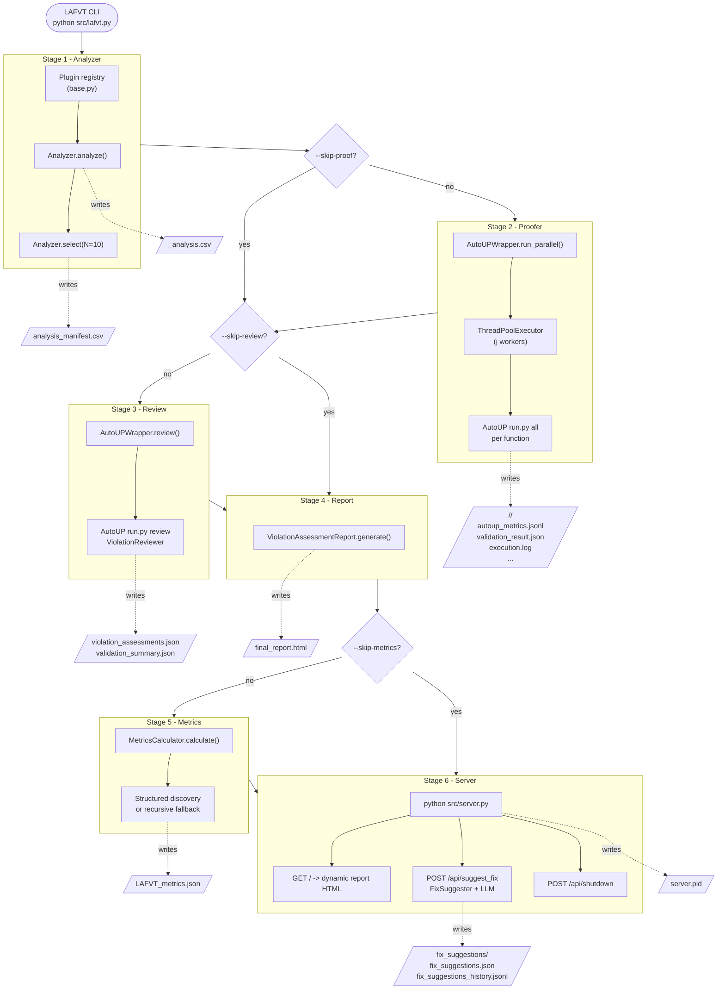
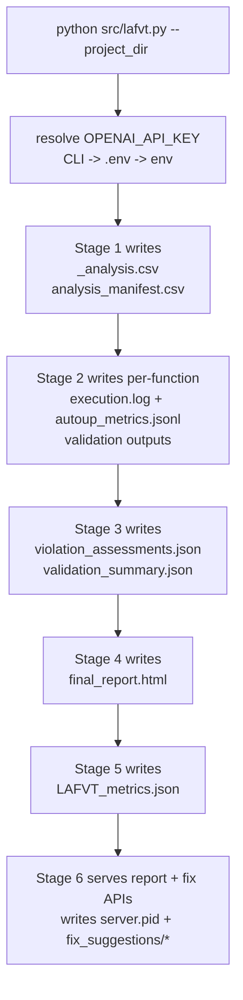

# LAFVT System Architecture

## Overview

LAFVT (Lightweight Automated Function Verification Toolchain) is a **six-stage pipeline** that:

1. Analyzes a C/C++ codebase and ranks functions by vulnerability risk
2. Proves selected functions with AutoUP in parallel workers
3. Reviews validation outcomes with an LLM-based reviewer and CVSS4 scoring
4. Generates an interactive HTML report
5. Computes token/cost/timing metrics
6. Launches a local interactive report server with on-demand fix suggestions

The orchestrator for the full run is [src/lafvt.py](src/lafvt.py).

---

## System Diagram



---

## Stage Details

### Stage 1 - Analyzer (`src/analyzer/`)

| Item | Detail |
|---|---|
| Orchestrator | `Analyzer` in [src/analyzer/_analyzer.py](src/analyzer/_analyzer.py) |
| Plugin model | Decorator registries in [src/analyzer/base.py](src/analyzer/base.py): `@register_algorithm`, `@register_selector`, `@register_post_selector` |
| Built-in algorithms | `lizard`, `loc`, `vccfinder` |
| Built-in selectors | `top_N`, `bottom_N`, `first`, `last`, `all` |
| Built-in post-selectors | `root_func_file`, `root_func_codebase` |
| Input | `target_dir` (defaults to `project_dir`, optional `--target_directory` bound to project) |
| Output 1 | `<algorithm>_analysis.csv` |
| Output 2 | `analysis_manifest.csv` (written from `Analyzer.select(output_path=...)`) |

Implementation notes:
- LAFVT orchestrator currently instantiates `Analyzer` with algorithm + selector and selects with `N=10` in [src/lafvt.py](src/lafvt.py).
- The analyzer package itself supports post-selector expansion and writes `analyzer_interm.csv` when post-selection is enabled.
- Analyzer runs standalone via `python -m analyzer` through [src/analyzer/__main__.py](src/analyzer/__main__.py).

---

### Stage 2 - Proofer (`src/autoup_wrapper.py` -> `AutoUP/src/run.py all`)

| Item | Detail |
|---|---|
| Entry point | `AutoUPWrapper.run_parallel(...)` in [src/autoup_wrapper.py](src/autoup_wrapper.py) |
| Input contract | `analysis_manifest.csv` (`filepath`, `function_name`) |
| Parallelism | `ThreadPoolExecutor(max_workers=j)` |
| Per-function invocation | AutoUP `run.py all` with harness path, file path, target function, model |
| Artifacts | Per-function folder with logs, metrics, and validation/proof artifacts |

Runtime behavior:
- Output is grouped under `<output_dir>/<file_slug>/<function_name>/`.
- Ctrl+C triggers cleanup (`cancel_all()`), escalating from terminate to kill if needed.

---

### Stage 3 - Review (`AutoUP review mode`)

| Item | Detail |
|---|---|
| Entry point | `AutoUPWrapper.review(...)` in [src/autoup_wrapper.py](src/autoup_wrapper.py) |
| AutoUP mode | `run.py review` |
| Reviewer agent | `ViolationReviewer` in [AutoUP/src/validator/violation_reviewer.py](AutoUP/src/validator/violation_reviewer.py) |
| Output files | `violation_assessments.json`, `validation_summary.json` |

Review-model specifics:
- Reviewer inspects `VIOLATED_BUGGY` outcomes extracted from validation results.
- LLM returns structured fields including call trace, variable origin, and threat context.
- Threat scoring uses CVSS4 vectors (`cvss.CVSS4`) and maps to integer threat scores.
- Output JSON includes top-level counts (`Correct Violations`, `Incorrect Violations`, `Threat Scores`) plus `Sorted Assessments`.

---

### Stage 4 - Report Generator (`src/report_generator.py`)

| Item | Detail |
|---|---|
| Class | `ViolationAssessmentReport` |
| Input | `violation_assessments.json` |
| Output | `final_report.html` |
| UX features | Score-grouped cards, search/filter, threat charts, light/dark mode toggle |

Rendered content includes:
- Violation assessment reasoning and reviewer agreement
- LLM review details (call trace, origin, threat assessment, threat score)
- Per-item Generate Code Fix button wired to server API
- Stop Server control wired to `/api/shutdown`

---

### Stage 5 - Metrics (`src/metrics_calculator.py`)

| Item | Detail |
|---|---|
| Class | `MetricsCalculator` |
| Input | `output_dir`, model pricing key, optional `source_dir` |
| Discovery strategy | 1) structured `<slug>/<func>/autoup_metrics.jsonl`, 2) recursive `*.jsonl` fallback |
| LOC strategy | 1) `analysis_manifest.csv`, 2) source-tree lookup via Lizard, 3) `null` |
| Output | `LAFVT_metrics.json` |

Calculated aggregates:
- Per-function and global token usage
- Cached/input/output cost breakdown
- Real vs serial execution timing
- Optional cost-per-100-LOC

Failure semantics:
- Stage 5 is non-fatal in [src/lafvt.py](src/lafvt.py): metrics failures are logged as warnings and pipeline continues.

---

### Stage 6 - Interactive Server + Fix Suggestions (`src/server.py`, `src/fix_suggester.py`)

| Item | Detail |
|---|---|
| Server | Flask app in [src/server.py](src/server.py) |
| Root route | `/` dynamically renders current report HTML from assessment JSON |
| Fix API | `POST /api/suggest_fix` invokes `FixSuggester.run(...)` |
| Shutdown API | `POST /api/shutdown` stops server |
| PID management | `server.pid` in output directory (also used by [src/stop_server.py](src/stop_server.py)) |

Fix-suggestion flow:
- Request carries target function and violated precondition.
- Server loads current assessment set, extracts function context and call-trace context, and prompts the LLM.
- Response is validated into a structured schema (`is_fixable`, explanation, code diff, extra changes).
- Results are persisted to:
  - `fix_suggestions/fix_suggestions.json` (latest run)
  - `fix_suggestions/fix_suggestions_history.jsonl` (append-only history)

---

## Analyzer Plugin Topology

```mermaid
flowchart LR
    subgraph Registry["src/analyzer/base.py"]
        AREG[("_ALGORITHM_REGISTRY")]
        SREG[("_SELECTOR_REGISTRY")]
        PREG[("_POST_SELECTOR_REGISTRY")]
    end

    subgraph Algo["src/analyzer/algorithms/"]
        LIZ["lizard"]
        LOC["loc"]
        VCC["vccfinder"]
    end

    subgraph Sel["src/analyzer/selectors/"]
        TOP["top_N"]
        BOT["bottom_N"]
        FST["first"]
        LST["last"]
        ALL["all"]
    end

    subgraph Post["src/analyzer/selectors/post/"]
        RFF["root_func_file"]
        RFC["root_func_codebase"]
    end

    Algo -->|@register_algorithm| AREG
    Sel -->|@register_selector| SREG
    Post -->|@register_post_selector| PREG
```

---

## Runtime Data Flow (Concrete Files)



---

## Output Directory Layout

```
<project_dir>/lafvt_output/
├── lafvt.log
├── timing_data.json
├── <algorithm>_analysis.csv
├── analysis_manifest.csv
├── <file_slug>/<function_name>/
│   ├── autoup_metrics.jsonl
│   ├── execution.log
│   ├── validation_result.json            # AutoUP-produced validation file
│   ├── violation.json                    # present when produced by AutoUP flow
│   └── build/
├── review_log.log
├── review_metrics.jsonl
├── violation_assessments.json
├── validation_summary.json
├── final_report.html
├── LAFVT_metrics.json
├── fix_suggestions/
│   ├── fix_suggestions.json
│   ├── fix_suggestions_history.jsonl
│   ├── fix_suggester.log
│   └── fix_suggester_server.log
└── server.pid
```

Notes:
- Some files are mode-dependent (`--skip-proof`, `--skip-review`, `--skip-metrics`).
- Server route resolution accepts either `violation_assessments.json` or a wildcard match ending in `violation_assessments.json`.

---

## CLI Surfaces

### Full pipeline

- Orchestrator: [src/lafvt.py](src/lafvt.py)
- Main controls:
  - `--project_dir` (required)
  - `--algorithm`, `--selector`
  - `--target_directory`
  - `--llm_model`, `--j`, `--OPENAI_API_KEY`
  - `--skip-proof`, `--skip-review`, `--skip-metrics`
  - `--demo`

### Stage runners

- AutoUP proof/review wrapper: [src/autoup_wrapper.py](src/autoup_wrapper.py)
- Analyzer standalone: `python -m analyzer` via [src/analyzer/__main__.py](src/analyzer/__main__.py)
- Metrics standalone: [src/metrics_calculator.py](src/metrics_calculator.py)
- Report server standalone: [src/server.py](src/server.py)
- Server stop helper: [src/stop_server.py](src/stop_server.py)

---

## Module Responsibilities

| Module | Owns |
|---|---|
| [src/lafvt.py](src/lafvt.py) | End-to-end orchestration, stage sequencing, skip flags, logging, timing, server launch |
| [src/analyzer/_analyzer.py](src/analyzer/_analyzer.py) | Analyzer orchestration, plugin dispatch, analysis/select CSV writing |
| [src/analyzer/base.py](src/analyzer/base.py) | Algorithm/selector/post-selector contracts + registries |
| [src/analyzer/algorithms/](src/analyzer/algorithms) | Concrete risk-scoring algorithms (`lizard`, `loc`, `vccfinder`) |
| [src/analyzer/selectors/](src/analyzer/selectors) | Selection strategies and post-selection expansion |
| [src/autoup_wrapper.py](src/autoup_wrapper.py) | Parallel proof and review subprocess facade over AutoUP |
| [AutoUP/src/validator/violation_reviewer.py](AutoUP/src/validator/violation_reviewer.py) | LLM-based violation assessment + CVSS4-based threat scoring |
| [src/report_generator.py](src/report_generator.py) | Interactive HTML rendering and embedded client actions |
| [src/fix_suggester.py](src/fix_suggester.py) | LLM fix suggestion generation and persistence |
| [src/server.py](src/server.py) | Flask server routes for dynamic report, fix API, and shutdown |
| [src/metrics_calculator.py](src/metrics_calculator.py) | Telemetry aggregation, pricing, LOC estimation, metrics JSON output |
