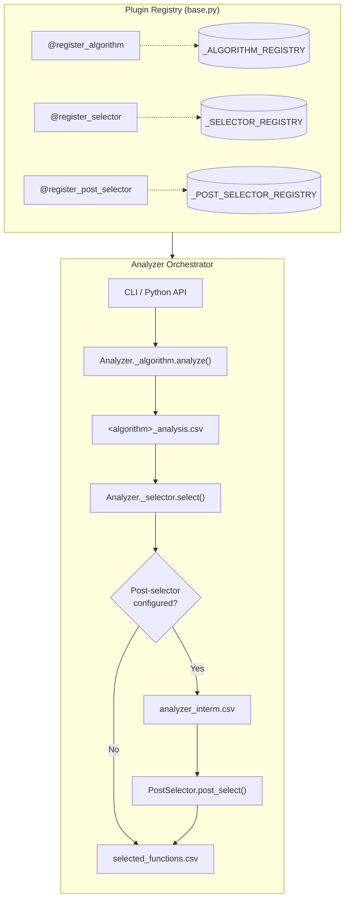
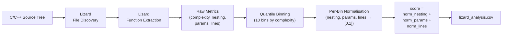
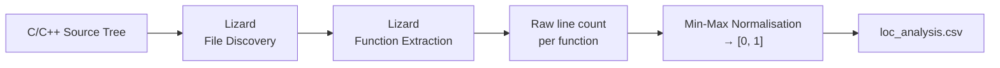
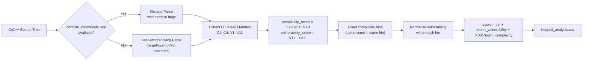
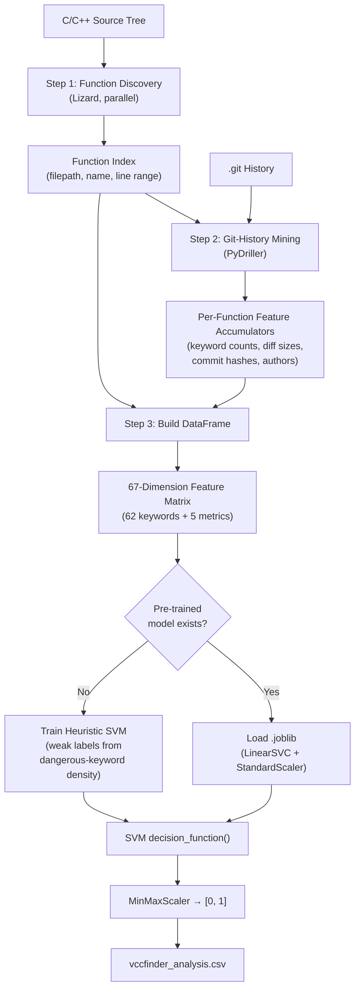
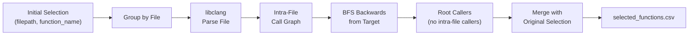
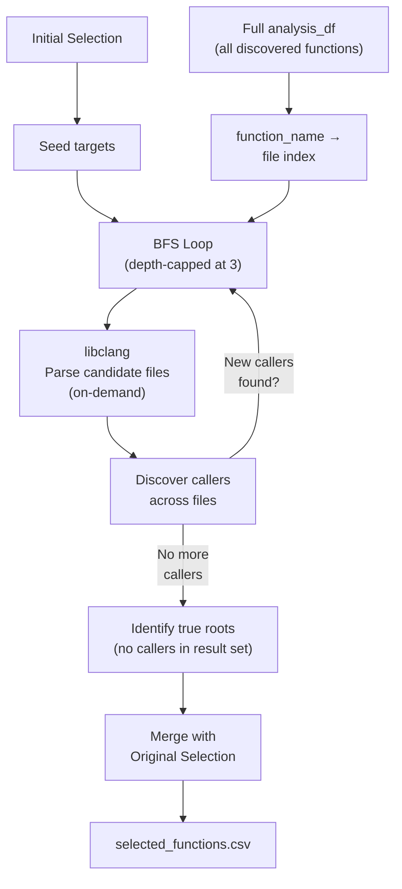

# Analyzer Module

The Analyzer is a standalone, pluggable component that scans a C/C++ codebase, scores every function for vulnerability risk, and produces two CSV files consumed by the rest of the LAFVT pipeline.

## Architecture



### Plugin system

All algorithms, selectors, and post-selectors are autodiscovered via a decorator-based registry in `base.py`. Adding a new plugin requires no changes to the orchestrator — only creating the module, decorating the class, and adding an import to the package `__init__.py`.

## Output files

| File | Columns | Description |
|---|---|---|
| `<algorithm>_analysis.csv` | `filepath`, `function_name`, + algorithm metrics | Full per-function analysis results |
| `selected_functions.csv` | `filepath`, `function_name` | Functions chosen by the selector (or post-selector) |
| `analyzer_interm.csv` | `filepath`, `function_name` | Initial selection before post-selector expansion (only written when `--post-selector` is used) |

`filepath` values are always **absolute** paths so they can be handed directly to downstream tools regardless of the working directory.

## Running standalone

```bash
cd src

# Defaults: lizard algorithm, top_N selector, threshold 10
python -m analyzer <path/to/source>

# Explicit options
python -m analyzer <path/to/source> \
    --algorithm lizard \
    --selector top_N \
    --threshold 5 \
    --output-dir ./output

# See all options
python -m analyzer --help
```

---

## Algorithms

### Lizard

**Flag:** `--algorithm lizard`

Computes cyclomatic complexity, nesting depth, parameter count, and line count per function using the [Lizard](https://github.com/terryyin/lizard) static analysis library. Metrics are normalised within complexity quantile bins; `score` is the sum of the three normalised values (higher = higher risk).

#### Dataflow



#### Scoring details

1. **Function extraction** — Lizard scans all `.c`, `.h`, `.cpp`, `.hpp`, `.cc` files and extracts every function with its cyclomatic complexity, top nesting level, parameter count, and line length.
2. **Complexity binning** — Functions are grouped into up to 10 quantile bins based on cyclomatic complexity rank. This ensures functions are compared against peers of similar complexity rather than being globally normalised.
3. **Per-bin normalisation** — Within each bin, nesting, parameter count, and line count are min-max normalised to [0, 1].
4. **Score** — The sum of the three normalised columns. Range is [0, 3]; higher values indicate more risk surface relative to similarly-complex functions.

#### Output columns

| Column | Description |
|---|---|
| `filepath` | Absolute POSIX path to the source file |
| `function_name` | Function / method name |
| `start_line` | First line of the function |
| `end_line` | Last line of the function |
| `complexity` | Cyclomatic complexity |
| `nesting` | Top nesting level |
| `params` | Parameter count |
| `lines` | Function length in lines |
| `bin` | Complexity quantile bin |
| `norm_nesting` | Bin-normalised nesting |
| `norm_params` | Bin-normalised parameter count |
| `norm_lines` | Bin-normalised line count |
| `score` | Sum of the three normalised columns |

---

### LOC (Lines of Code)

**Flag:** `--algorithm loc`

Scores functions by raw line count, normalised to [0, 1] across the codebase. The longest function scores 1.0. Simple and fast — useful as a baseline or for quick triage.

#### Dataflow



#### Scoring details

1. **Function extraction** — Same Lizard-based scan as the Lizard algorithm.
2. **Normalisation** — Each function's line count is min-max scaled to [0, 1] across all discovered functions. The longest function scores 1.0; a single-line function scores 0.0.

#### Output columns

| Column | Description |
|---|---|
| `filepath` | Absolute POSIX path to the source file |
| `function_name` | Function / method name |
| `start_line` | First line of the function |
| `end_line` | Last line of the function |
| `lines` | Raw line count of the function |
| `score` | Lines normalised to [0, 1] across all functions |

---

### LEOPARD

**Flag:** `--algorithm leopard`

Implements a LEOPARD-style AST metric extractor using libclang and maps each function to a risk `score` through complexity-first binning and vulnerability ranking within each bin.

#### Dataflow



#### Scoring details

1. **AST extraction** — Parses C/C++ files with libclang and computes LEOPARD families:
     - Complexity: `C1..C4`
     - Vulnerability: `V1..V11`
2. **Family totals** — Builds `complexity_score = C1 + C2 + C3 + C4` and `vulnerability_score = V1 + ... + V11`.
3. **Complexity binning** — Functions are grouped by exact `complexity_score` value (not quantiles).
4. **In-bin normalisation** — `vulnerability_score` is min-max normalised within each complexity bin (`norm_vulnerability`).
5. **Final score** — `score = bin + norm_vulnerability + 0.001 * norm_complexity`, ensuring higher-complexity bins are always prioritised while preserving vulnerability ordering inside each bin.

#### Parsing behaviour

- If `compile_commands.json` exists at the analysis root, LEOPARD uses it for translation-unit parsing.
- Otherwise, LEOPARD falls back to best-effort parsing over discovered source files.
- Optional environment overrides:
    - `LIBCLANG_FILE` — explicit libclang shared library path
    - `LAFVT_LEOPARD_TARGET` — target triple override
    - `LAFVT_LEOPARD_SYSROOT` — sysroot override
    - `LAFVT_LEOPARD_STD` — C standard (default `c11`)

#### Output columns

| Column | Description |
|---|---|
| `filepath` | Absolute POSIX path to the source file |
| `function_name` | Function name |
| `start_line` | First line of the function |
| `end_line` | Last line of the function |
| `C1..C4` | Complexity metric family |
| `V1..V11` | Vulnerability metric family |
| `complexity_score` | `C1 + C2 + C3 + C4` |
| `vulnerability_score` | `V1 + ... + V11` |
| `bin` | Exact complexity bin id |
| `norm_vulnerability` | Bin-normalised vulnerability score |
| `norm_complexity` | Global min-max normalised complexity score |
| `score` | Final LEOPARD ranking score |

---

### VCCFinder

**Flag:** `--algorithm vccfinder`

Implements the [VCCFinder methodology](https://dl.acm.org/doi/10.1145/2810103.2813604) (Perl et al., CCS 2015) adapted for the LAFVT analyzer plugin framework. Mines local git history with [PyDriller](https://github.com/ishepard/pydriller), extracts C/C++ structural-keyword features and commit metadata from diffs, and classifies each function via a `LinearSVC` ([scikit-learn](https://scikit-learn.org/)). Runs entirely offline with no GPU.

#### Dataflow



#### Pipeline details

**Step 1 — Function discovery.** Lizard extracts every C/C++ function with its file path and line range, parallelised across multiple threads (`ThreadPoolExecutor`). Same `.c`, `.h`, `.cpp`, `.hpp`, `.cc` extensions are accepted.

**Step 2 — Git-history mining.** PyDriller walks local commits (capped at 5,000, merge commits skipped, path-filtered to the target directory). For each commit touching a C/C++ file, diff hunks are parsed and attributed to discovered functions by line-range overlap. Per-function accumulators track:
- Counts of 62 C/C++ structural keywords found in added/removed lines
- Lines added, lines removed
- Set of commit hashes and distinct authors

**Step 3 — DataFrame construction.** Function metadata and mined features are merged into a DataFrame with 67 feature columns (62 keyword counts + `lines_added`, `lines_removed`, `churn`, `commit_count`, `author_count`).

**Step 4 — SVM classification.** The feature matrix is fed to a `LinearSVC`:
- If a pre-trained `.joblib` model is found, it is loaded (with its `StandardScaler`) and used for inference.
- Otherwise, a heuristic SVM is trained on-the-fly using weak labels: functions with above-median dangerous-keyword density are labelled positive.
- The SVM `decision_function()` distance is normalised to [0, 1] via `MinMaxScaler` to produce the final `score`.

#### Output columns

| Column | Description |
|---|---|
| `filepath` | Absolute POSIX path to the source file |
| `function_name` | Function / method name |
| `start_line` | First line of the function |
| `end_line` | Last line of the function |
| `score` | SVM decision-function distance, normalised to [0, 1] |
| `keyword_count` | Total structural-keyword hits across all diffs for this function |
| `lines_added` | Total lines added to this function across commits |
| `lines_removed` | Total lines removed from this function across commits |
| `churn` | `lines_added + lines_removed` |
| `commit_count` | Number of commits that touched this function |
| `author_count` | Number of distinct authors who modified this function |

#### Feature vector (67 dimensions)

- **62 C/C++ structural keywords** extracted from diffs: `if`, `else`, `for`, `while`, `do`, `switch`, `case`, `break`, `continue`, `default`, `return`, `goto`, `malloc`, `calloc`, `realloc`, `free`, `memcpy`, `memmove`, `memset`, `strcpy`, `strncpy`, `strcat`, `strncat`, `strcmp`, `strlen`, `sprintf`, `snprintf`, `printf`, `fprintf`, `scanf`, `sizeof`, `typeof`, `offsetof`, `alignof`, `NULL`, `void`, `static`, `extern`, `const`, `volatile`, `unsigned`, `signed`, `typedef`, `struct`, `union`, `enum`, `register`, `inline`, `restrict`, `char`, `int`, `float`, `double`, `long`, `short`, `auto`, `define`, `include`, `ifdef`, `ifndef`, `endif`, `pragma`, `assert`, `exit`, `abort`, `_Bool`, `_Complex`, `_Atomic`
- **5 commit metrics:** `lines_added`, `lines_removed`, `churn`, `commit_count`, `author_count`

A subset of 17 keywords (`malloc`, `calloc`, `realloc`, `free`, `memcpy`, `memmove`, `memset`, `strcpy`, `strncpy`, `strcat`, `strncat`, `sprintf`, `printf`, `fprintf`, `scanf`, `goto`, `sizeof`, `NULL`) are flagged as **dangerous keywords** and used for heuristic labelling when no pre-trained model is available.

#### SVM model

The algorithm ships with a pre-trained `LinearSVC` model bundled at `algorithms/models/vccfinder_model.joblib`.

**Model resolution order:**

1. **Project override** — `vccfinder_model.joblib` in the current working directory
2. **Bundled default** — `analyzer/algorithms/models/vccfinder_model.joblib` (shipped with the repository)
3. **Heuristic fallback** — a lightweight SVM trained on-the-fly from the mined commit data using dangerous-keyword density as a signal

**Training data — CVEfixes:**

The bundled model was trained on the [CVEfixes](https://zenodo.org/records/7029359) dataset (v1.0.8) by Bhandari et al. CVEfixes is a comprehensive, automatically collected dataset of real-world vulnerability fixes mined from the National Vulnerability Database (NVD) and linked open-source repositories. It covers 5,495 CVEs across 1,754 projects.

> G. Bhandari, A. Naseer, and L. Moonen, "CVEfixes: Automated Collection of Vulnerabilities and Their Fixes from Open-Source Software," *Proceedings of the 17th International Conference on Predictive Models and Data Analytics in Software Engineering (PROMISE '21)*, pp. 30–39, 2021. [doi:10.1145/3475960.3475985](https://doi.org/10.1145/3475960.3475985)

For training, CVE-fixing diffs for C and C++ files are split into removed lines (labeled vulnerable) and added lines (labeled fixed). The keyword feature vector is extracted from each side. The bundled model was trained on 16,541 samples (7,265 vulnerable / 9,276 fixed).

**Re-training the model:**

```bash
python src/train_vccfinder.py <path/to/CVEfixes.db> \
    --output src/analyzer/algorithms/models/vccfinder_model.joblib
```

#### References

- Perl, H. et al. "VCCFinder: Finding Potential Vulnerabilities in Open-Source Projects to Assist Code Audits." *CCS 2015*. [doi:10.1145/2810103.2813604](https://doi.org/10.1145/2810103.2813604)
- Bhandari, G. et al. "CVEfixes: Automated Collection of Vulnerabilities and Their Fixes from Open-Source Software." *PROMISE '21*. [doi:10.1145/3475960.3475985](https://doi.org/10.1145/3475960.3475985)

---

## Selectors

All selectors operate on the canonical `score` column produced by every algorithm. `N` accepts either an integer (e.g. `5`) or a percentage string (e.g. `"10%"`).

| Name | Flag | Description |
|---|---|---|
| Top N | `--selector top_N` | Top-N functions by descending `score` (use `--threshold` to set N) |
| Bottom N | `--selector bottom_N` | Bottom-N functions by ascending `score` (use `--threshold` to set N) |
| First | `--selector first` | First function in analysis output order |
| Last | `--selector last` | Last function in analysis output order |
| All | `--selector all` | Every function, no filtering |

---

## Post-Selectors

Post-selectors are an optional expansion step that runs **after** the initial selector. They take the selected function set and expand it — typically by tracing call-graph relationships to discover additional functions of interest.

Add `--post-selector <name>` to any analyzer invocation. When a post-selector is active, the initial selection is saved as `analyzer_interm.csv` before expansion.

```bash
python -m analyzer <path/to/source> \
    --algorithm lizard --selector top_N --threshold 5 \
    --post-selector root_func_file
```

| Name | Flag | Description |
|---|---|---|
| Root Func File | `--post-selector root_func_file` | For each selected function, traces callers **within the same file** back to root callers (functions with no intra-file callers). |
| Root Func Codebase | `--post-selector root_func_codebase` | Same approach but traces callers **across the entire codebase**, using BFS with targeted on-demand parsing. |

### root_func_file

For each selected function, parses its source file with libclang and walks the intra-file call graph backwards to find root callers — functions that are not called by any other function in the same file.

#### Dataflow



**Example:** If function C is selected and within its file D calls C while A and B call D, then A and B are identified as root callers. The output contains A, B, **and** C.

### root_func_codebase

Same approach but traces callers across the entire codebase using targeted on-demand parsing. Only files that might contain callers are parsed (not the full source tree).

#### Dataflow



The BFS iteratively expands: at each depth level, newly discovered callers become the next set of targets. Parsing is cached, so files are never parsed twice.

### Limitations

- **Function pointers / indirect calls** — libclang's AST does not resolve calls through function pointers (e.g. `callback()`). Only direct `CALL_EXPR` nodes are traced.
- **Include path resolution** — For cross-file call tracing, libclang may not resolve all `#include` directives without project-specific include paths. Intra-file tracing (`root_func_file`) is unaffected.


---

## Adding a new algorithm

1. Copy `algorithms/_template.py` to `algorithms/my_algo.py`
2. Set `name = "my_algo"` and implement the `analyze(root_directory)` method — return a `DataFrame` with at minimum `filepath` and `function_name` columns
3. Add `from . import my_algo` to `algorithms/__init__.py`

The new algorithm will be immediately available via `--algorithm my_algo` with no other changes required.

## Adding a new selector

Same process but inherit from `SelectorAlgorithm`, implement `select(df, N)`, use `@register_selector`, place the file under `selectors/`, and add the import to `selectors/__init__.py`.

## Adding a new post-selector

1. Create `selectors/post/my_post.py`
2. Define a class inheriting from `PostSelectorAlgorithm` with `name = "my_post"`
3. Implement `post_select(selected_df, analysis_df, source_root) → DataFrame`
4. Decorate with `@register_post_selector`
5. Add `from . import my_post` to `selectors/post/__init__.py`

## Using the Analyzer from Python

```python
from pathlib import Path
from analyzer import Analyzer

analyzer = Analyzer(
    project_root=Path("./output"),
    algorithm="lizard",
    selector="top_N",
)

# Phase 1 — writes lizard_analysis.csv to output/
analysis_csv = analyzer.analyze(Path("/path/to/source"))

# Phase 2 — writes selected_functions.csv to output/
#            returns list of dicts with all analysis columns + code
selected = analyzer.select(N=5)
for func in selected:
    print(func["function_name"], func["filepath"])
```
